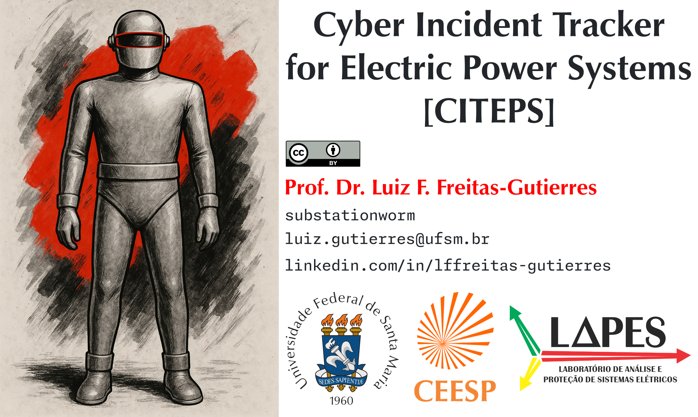
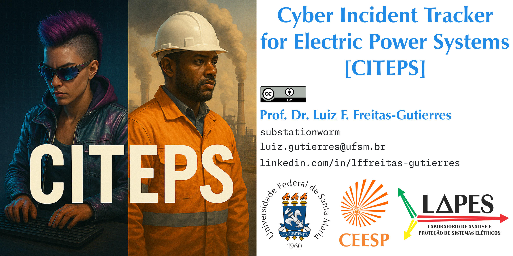

# CITEPS: Cyber Incident Tracker for Electric Power Systems

*Tip: Click on the table and use the arrow keys on your keyboard to navigate between columns.*

| 🕵️‍♂️ Codename | 🚨 Category | 📅 Year | 🌎 Region | ⚙️ Sector | 🏢 Affected Organization | 💀 Threat Actor | 🛠️ MITRE ATT&CK® Enterprise | 🏭 MITRE ATT&CK® ICS | 🐞 Vulnerabilities and Key Points | 🔗 References |
|---|---|---|---|---|---|---|---|---|---|---|
| 1982USRR-Pipeline | ☠️ Critical | 1982 | 🇷🇺 Russia | 1️⃣ Energy 2️⃣ Transport 9️⃣ Industry | 🌀 Gas pipeline | 🤔🇺🇸 United States | 🌀 | 🌀 | 🤔 Use of a trojan to sabotage a gas pipeline | [ref. 01][ref01-1982usrr-pipeline] [ref. 02][ref02-1982usrr-pipeline] |
| 1999Gazprom | ☠️ Critical | 1999 | 🇷🇺 Russia | 1️⃣ Energy 2️⃣ Transport 9️⃣ Industry | Gazprom | 🌀 | 🌀 | 🌀 | Compromised SCADA | [ref.][ref-1999gazprom] |
| 2003SlammerWorm | ☠️ Critical | 2003 | 🇺🇸 United States | 1️⃣ Energy | Davis-Besse Nuclear Power Station | 🌀 | 🌀 | 🌀 | Compromised OT-ICS network Infected SPDS | [ref. 01][ref01-2003slammerworm] [ref. 02][ref02-2003slammerworm] |
| 2008HatchNPP | ☠️ Critical | 2008 | 🇺🇸 United States | 1️⃣ Energy | Edwin I. Hatch Nuclear Power Plant | Insider |🌀 | 🌀 | Emergency shutdown Engineer mistake | [ref.][ref-2008hatchnpp] |
| 2009Cyberspies | 🟢 Low | 2009 | 🇺🇸 United States | 1️⃣ Energy | Electricity infrastructure | 🌀 | 🌀 | 🌀 | Cyber espionage | [ref. 01][ref01-2009cyberspies] [ref. 02][ref02-2009cyberspies] |
| 2010Stuxnet | ☠️ Critical | 2010 | 🇮🇷 Iran | 1️⃣ Energy | Natanz Nuclear Facility | 🇺🇸 United States 🇮🇱 Israel | [T1091][t1091] | [T0847][t0847] | [Stuxnet][stuxnet] infected PCs and destroyed 984 centrifuges [CVE-2010-2772][cve-2010-2772] [CVE-2010-2729][cve-2010-2729] [CVE-2010-2743][cve-2010-2743] | [ref. 01][ref01-2010stuxnet] [ref. 02][ref02-2010stuxnet] [ref. 03][ref03-2010stuxnet] |
| 2011NightDragon | 🟢 Low | 2011 | 🇺🇸 United States 🗺️ Others | 1️⃣ Energy | Oil, energy, and petrochemical sectors | Night Dragon | [T1078][t1078] [T1110][t1110] [T1133][t1133] [T1566][t1566] | 🌀 | Data breach [SCADA data collected][nightdragon] | [ref.][ref-2011nightdragon] |
| 2012ANDE | 🟢 Low | 2012 | 🇵🇾 Paraguay | 1️⃣ Energy | ANDE | 🤔 Anonymous | 🌀 | 🌀 | Website defacement | [ref.][ref-2012ande] | 
| 🚫🗣️ 2012IRN-AC-DC | 🟡 Moderate | 2012 | 🇮🇷 Iran | 1️⃣ Energy | Natanz and Fordo Nuclear Facilities | 🌀 | 🌀 | [T0822][t0822] | Automation system shutdown| [ref. 01][ref01-2012irn-ac-dc] [ref. 02][ref02-2012irn-ac-dc] |
| 2012IRN-OilInd | 🟢 Low | 2012 | 🇮🇷 Iran | 1️⃣ Energy 2️⃣ Transport 9️⃣ Industry | Oil facilities | 🌀 | 🌀 | 🌀 | [Flame][flame]/Wiper malware deployed Oil terminals disconnected from Internet | [ref. 01][ref01-2012irn-oilind] [ref. 02][ref02-2012irn-oilind] [ref. 03][ref03-2012irn-oilind] |
| 2012SaudiAramco | 🟢 Low | 2012 | 🇸🇦 Saudi Arabia | 1️⃣ Energy 9️⃣ Industry | Saudi Aramco | Cutting Sword of Justice | [T1566][t1566] | 🌀 | [Shamoon][shamoon] deployed 85% of IT infrastructure was disrupted | [ref. 01][ref01-2012saudiaramco] [ref. 02][ref02-2012saudiaramco] |
| 2012Telvent | 🟡 Moderate | 2012 | 🇨🇦 Canada 🗺️ Others | 1️⃣ Energy 9️⃣ Industry | Telvent | 🤔 Comment Group | 🌀 | 🌀 | Corporate network intrusion Theft of SCADA system source code | [ref. 01][ref01-2012telvent] [ref. 02][ref02-2012telvent] |
| 2012USA-PowerCompany | 🔴 High | 2012 | 🇺🇸 United States | 1️⃣ Energy | Power company | 🌀 | 🌀 | [T0847][t0847] | Mariposa-infected USB-drive Power plant restart delayed ~3 weeks | [ref.][ref-2012usa-powercompany] |
| 2014DEU-SteelMill | ☠️ Critical | 2014 | 🇩🇪 Germany 🗺️ Others | 9️⃣ Industry | Steel Mill | 🌀 | [T1566][t1566] | 🌀 | Spearphishing  Compromise of ICS confirmed Uncontrolled shutdown led to major damage | [ref. 01][ref01-2014deu-steelmill] [ref. 02][ref02-2014deu-steelmill] |
| 2014Dragonfly | 🔴 High | 2014 | 🇪🇸 Spain 🇺🇸 United States 🗺️ Others | 1️⃣ Energy | Energy firms | [Dragonfly][dragonfly] | [T1078][t1078] [T1110][t1110] [T1133][t1133] [T1566][t1566] | [T0817][t0817] [T0862][t0862] | Update site compromised to deliver trojanized ICS software | [ref. 01][ref01-2014dragonfly] [ref. 02][ref02-2014dragonfly] |
| 2014KHNP | 🟢 Low | 2014 | 🇰🇷 South Korea | 1️⃣ Energy | Korea Hydro and Nuclear Power (KHNP) plants | Kimsuky | [T1566][t1566] | 🌀 | Data breach | [ref. 01][ref01-2014khnp] [ref. 02][ref02-2014khnp] |
| 2014Monju | 🟢 Low | 2014 | 🇯🇵 Japan | 1️⃣ Energy | Monju Nuclear Power Plant | 🌀 | 🌀 [T1195.002][t1195.002] | 🌀 | Malware introduced during system update by employee 🤔 Data breach | [ref. 01][ref01-2014monju] [ref. 02][ref02-2014monju] |
| 2015UKR-PwrSysAtk | ☠️ Critical | 2015 | 🇺🇦 Ukraine | 1️⃣ Energy | Prykarpattyaoblenergo Kyivoblenergo Chernivtsioblenergo | [Sandworm Team][sandwormteam] | [T1078][t1078] [T1133][t1133] [T1566.001][t1566.001] | [T0822][t0822] [T0886][t0886] | Phishing campaigns to deliver [BlackEnergy][blackenergy] and [KillDisk][killdisk] | [ref.][ref-2015ukr-pwrsysatk] |
| 2016Gundremmingen | 🟡 Moderate | 2016 | 🇩🇪 Germany | 1️⃣ Energy | Gundremmingen Nuclear Power Plant | 🌀 | 🌀 [T1091][t1091] | 🌀 [T0847][t0847] | W32.Ramnit & [Conficker][conficker] detected | [ref. 01][ref01-2016gundremmingen] [ref. 02][ref02-2016gundremmingen] [ref. 03][ref03-2016gundremmingen] |
| 2016ThyssenKrupp | 🟢 Low | 2016 | 🇩🇪 Germany | 9️⃣ Industry | ThyssenKrupp | 🌀 | 🌀 | 🌀 | Cyber espionage | [ref. 01][ref01-2016thyssenkrupp] [ref. 01][ref01-2016thyssenkrupp] |
| 2016UKR-PwrSysAtk | ☠️ Critical | 2016 | 🇺🇦 Ukraine | 1️⃣ Energy | Ukrenergo | [Sandworm Team][sandwormteam] | 🤔 [T1566][t1566] | [T0886][t0886] | Phishing campaings to deliver [Industroyer][industroyer], aka, [CRASHOVERRIDE][crashoverride] | [ref. 01][ref01-2016ukr-pwrsysatk] [ref. 02][ref02-2016ukr-pwrsysatk] [ref. 03][ref03-2016ukr-pwrsysatk] |
| 🚫🗣️ 2017SaudiAramco | ☠️ Critical | 2017 | 🇸🇦 Saudi Arabia | 1️⃣ Energy 9️⃣ Industry | 🤔 Saudi Aramco 🤔 Petro Rabigh | 🌀 | 🌀 | 🌀 | SIS targeted [Triton][triton] malware-driven attack | [ref. 01][ref01-2017saudiaramco] [ref. 02][ref02-2017saudiaramco] [ref. 03][ref03-2017saudiaramco] [ref. 04][ref04-2017saudiaramco] [ref. 05][ref05-2017saudiaramco] [ref. 06][ref06-2017saudiaramco] |
| 2019JoburgCityPower | 🟡 Moderate | 2019 | 🇿🇦 South Africa | 1️⃣ Energy | City Power Johannesburg | 🌀 | 🌀 | 🌀 | Ransomware attack Unavailability of services Prepaid customer outages | [ref. 01][ref01-2019joburgcitypower] [ref. 02][ref02-2019joburgcitypower] [ref. 03][ref03-2019joburgcitypower] |
| 2019NorskHydro | 🟡 Moderate | 2019 | 🇳🇴 Norway | 1️⃣ Energy 9️⃣ Industry | Norsk Hydro | 🌀 | [T1566][t1566] | 🌀 | [LockerGoga][lockergoga] deployed Ransomware attack Unavailability of services Production lines were halted Ransom payment refused | [ref. 01][ref01-2019norskhydro] [ref. 02][ref02-2019norskhydro] [ref. 03][ref03-2019norskhydro] [ref. 04][ref04-2019norskhydro] |
| 2019NPCIL | 🟢 Low | 2019 | 🇮🇳 India | 1️⃣ Energy | NPCIL | 🤔 Lazarus | [T1200][t1200] | 🌀 | [Dtrack][dtrack] deployed Data breach No impact to OT network | [ref. 01][ref01-2019npcil] [ref. 02][ref02-2019npcil] [ref. 03][ref03-2019npcil] |
| 2019PEMEX | 🟢 Low | 2019 | 🇲🇽 Mexico | 1️⃣ Energy | PEMEX | 🌀 | 🌀 | 🌀 | Ransomware attack Unavailability of services Power supply remained intact [DoppelPaymer][doppelpaymer] deployed USD 4.9 million demanded | [ref. 01][ref01-2019pemex] [ref. 02][ref02-2019pemex] [ref. 03][ref03-2019pemex] |
| 2020CEMIG | 🟢 Low | 2020 | 🇧🇷 Brazil | 1️⃣ Energy | CEMIG | 🤔 HelloKitty Group | 🌀 | 🌀 | Ransomware attack Unavailability of services and website Power supply remained intact [HELLOKITTY][hellokitty] deployed | [ref. 01][ref01-2020cemig]  [ref. 02][ref02-2020cemig] [ref. 03][ref03-2020cemig] |
| 2020CNEL | 🟢 Low | 2020 | 🇪🇨 Ecuador | 1️⃣ Energy | ENEL | 🌀 | 🌀 | 🌀 | Ransomware attack Unavailability of services | [ref.][ref-2020cnel] |
| 🚫🗣️ 2020CPFL | 🟢 Low | 2020 | 🇧🇷 Brazil | 1️⃣ Energy | CPFL Energia | 🤔 [Maze Group][mazegroup] | 🌀 | 🌀 | 🤔 Data breach | [ref. 01][ref01-2020cpfl] [ref. 02][ref02-2020cpfl] [ref. 03][ref03-2020cpfl] |
| 2020EDP | 🟢 Low | 2020 | 🇵🇹 Portugal 🗺️ Others | 1️⃣ Energy | EDP | [Ragnar Locker Group][ragnarlockergroup] | 🌀 | 🌀 | Ransomware attack EUR 10 million demanded [Ragnar Locker][ragnarlocker] deployed | [ref. 01][ref01-2020edp] [ref. 02][ref02-2020edp] |
| 2020Enel | 🟢 Low | 2020 | 🇧🇷 Brazil | 1️⃣ Energy | Enel São Paulo | 🌀 | 🌀 | 🌀 | Data breach | [ref. 01][ref01-2020enel] [ref. 02][ref02-2020enel] |
| 2020Energisa | 🟢 Low | 2020 | 🇧🇷 Brazil | 1️⃣ Energy | Energisa | 🌀 | 🌀 | 🌀 | 🤔 Vulnerability exploitation on a JBoss server Ransomware attack Unavailability of services and website Power supply remained intact BRL 5 million demanded | [ref. 01][ref01-2020energisa] [ref. 02][ref02-2020energisa] |
| 2020Light | 🟢 Low | 2020 | 🇧🇷 Brazil | 1️⃣ Energy | Light | 🤔 [GOLD SOUTHFIELD][goldsouthfield] | 🌀 | 🌀 | Ransomware attack Unavailability of services and website Power supply remained intact [REvil (Sodinokibi)][revil] deployed [USD 7 million demanded, doubled after 48 hours][light01] | [ref. 01][ref01-2020light] [ref. 02][ref02-2020light] [ref. 03][ref03-2020light] |
| 2020USA-Pipeline | ☠️ Critical | 2020 | 🇺🇸 United States | 1️⃣ Energy 2️⃣ Transport 9️⃣ Industry | Natural gas facility | 🌀 | [T1566.002][t1566.002] | 🌀 | Ransomware attack Unavailability of services Affected both IT and OT Pipele shutdown for two days | [ref. 01][ref01-2020usa-pipeline] [ref. 02][ref02-2020usa-pipeline] |
| 2021ColonialPipeline | ☠️ Critical | 2021 | 🇺🇸 United States | 1️⃣ Energy 2️⃣ Transport 9️⃣ Industry | Colonial Pipeline | [DarkSide Team][darksideteam] | [T1078][t1078] | 🌀 | Ransomware attack [VPN password compromised][colonial01] [Over USD 5 million paid][colonial02] | [ref.][ref-2021colonialpipeline] |
| 2021Copel | 🟢 Low | 2021 | 🇧🇷 Brazil | 1️⃣ Energy 4️⃣ Communications | Copel | [DarkSide Team][darksideteam] | 🌀 | 🌀 | Ransomware attack Unavailability of services and website Power supply remained intact | [ref. 01][ref01-2021copel] [ref. 02][ref02-2021copel] |
| 2021Eletrobras | 🟢 Low | 2021 | 🇧🇷 Brazil | 1️⃣ Energy | Eletrobras Eletronuclear | 🌀 | 🌀 | 🌀 | Ransomware attack Unavailability of services Power supply remained intact | [ref. 01][ref01-2021eletrobras] [ref. 02][ref02-2021eletrobras] |
| 2022ECG | 🟡 Moderate | 2022 | 🇬🇭 Ghana | 1️⃣ Energy | Electricity Company of Ghana | 🌀 | 🌀 | 🌀 | Ransomware attack Unavailability of services Prepaid customer outages | [ref. 01][ref01-2022ecg] [ref. 02][ref02-2022ecg] |
| 2022EPM01 | 🟢 Low | 2022 | 🇨🇴 Colombia | 1️⃣ Energy | EPM | BlackCat Group | 🌀 | 🌀 | Ransomware attack Unavailability of services Power supply remained intact [BlackCat][blackcat] deployed | [ref. 01][ref01-2022epm01] [ref. 02][ref02-2022epm01] [ref. 03][ref03-2022epm01] |
| 2022EPM02 | 🟢 Low | 2022 | 🇨🇴 Colombia | 1️⃣ Energy | EPM Afinia | 🌀 | 🌀 | 🌀 | Unavailability of services | [ref.][ref-2022epm02] |
| 2022Jasec | 🟢 Low | 2022 | 🇨🇷 Costa Rica | 1️⃣ Energy 4️⃣ Communications | Jasec | 🌀 | 🌀 | 🌀 | Ransomware attack Unavailability of services Power supply remained intact [Conti][conti] deployed | [ref. 01][ref01-2022jasec] [ref. 02][ref02-2022jasec] [ref. 03][ref03-2022jasec] |
| 2022OilIndia | 🟢 Low | 2022 | 🇮🇳 India | 1️⃣ Energy 9️⃣ Industry | Oil India Limited | 🌀 | 🌀 | 🌀 | Ransomware attack Unavailability of services Drilling and production remained unaffected | [ref. 01][ref01-2022oilindia] [ref. 02][ref02-2022oilindia] |
| 2022PEMEX | 🟢 Low | 2022 | 🇲🇽 Mexico | 1️⃣ Energy | PEMEX | 🌀 | 🌀 | 🌀 | Data breach | [ref.][ref-2022pemex] |
| [2022PredatorySparrow][2022predatorysparrow] | ☠️ Critical | 2022 | 🇮🇷 Iran | 9️⃣ Industry | KSC, MSC, HOSCO | Predatory Sparrow | 🌀 | 🌀 | OT disruption [CCTV footage of the incident][predatorysparrow01] | [ref. 01][ref01-2022predatorysparrow] [ref. 02][ref02-2022predatorysparrow] |
| 2022Rosseti | 🟢 Low | 2022 | 🇷🇺 Russia | 1️⃣ Energy 2️⃣ Transport | Rosseti | AutoEnterprise | 🌀 | 🌀 | EV charging disabled HMI defaced | [ref. 01][ref01-2022rosseti] | [ref. 02][ref02-2022rosseti] |
| 2022UKR-PwrSysAtk01 | 🟡 Moderate | 2022 | 🇺🇦 Ukraine | 1️⃣ Energy | 🌀 Electric utility | [Sandworm Team][sandwormteam] | 🌀 | 🌀 | [Industroyer2][industroyer2] deployed 🌀 Unsuccessful attack | [ref.][ref-2022ukr-pwrsysatk01] |
| 2022UKR-PwrSysAtk02 | ☠️ Critical | 2022 | 🇺🇦 Ukraine | 1️⃣ Energy | 🌀 Substation | [Sandworm Team][sandwormteam] | 🌀 | 🌀 | Threat actor gained access to SCADA Used OT-based LotL techniques, [CaddyWiper][caddywiper], and other tools | [ref.][ref-2022ukr-pwrsysatk02]
| 🚫🗣️ 2023CAN-Pipeline | 🔴 High | 2023 | 🇨🇦 Canada | 1️⃣ Energy 2️⃣ Transport 9️⃣ Industry | Gas pipeline | Zarya | 🌀 | 🌀 | Compromise of OT 🤔 Disinformation | [ref. 01][ref01-2023can-pipeline] [ref. 02][ref02-2023can-pipeline] [ref. 03][ref03-2023can-pipeline] |
| 2023DNK-LargestCyberAtk | 🔴 High | 2023 | 🇩🇰 Denmark | 1️⃣ Energy | Twenty two companies | 🤔 [Sandworm Team][sandwormteam] | [T1133][t1133] | 🌀 | [CVE-2023-28771][cve-2023-28771] [CVE-2023-33009][cve-2023-33009] [CVE-2023-33010][cve-2023-33010] | [ref.][ref-2023dnk-largestcyberatk] |
| 2023Hydro-Québec | 🟢 Low | 2023 | 🇨🇦 Canada | 1️⃣ Energy | Hydro-Québec | Pro-Russian group | 🌀 | 🌀 | DDoS attack Website temporarily unavailable | [ref. 01][ref01-2023hydroquebec] [ref. 02][ref02-2023hydroquebec] [ref. 03][ref03-2023hydroquebec] |
| 2023SuncorEnergy | 🟡 Moderate | 2023 | 🇨🇦 Canada | 1️⃣ Energy 2️⃣ Transport | Suncor Energy Petro Canada | 🌀 | 🌀 | 🌀 | 🤔 Ransomware attack 🤔 Data breach Login down on app/site; no points at pumps for customers | [ref. 01][ref01-2023suncorenergy] [ref. 02][ref02-2023suncorenergy] [ref. 03][ref03-2023suncorenergy] [ref. 04][ref04-2023suncorenergy] |
| 2023UnitronicsDeface | 🔴 High | 2023 | 🇺🇸 United States 🇮🇱 Israel 🇮🇪 Ireland 🗺️ Others | 1️⃣ Energy 3️⃣ Water and wastewater 9️⃣ Industry 🔟 Health | Owners of Unitronics Vision Series PLCs | [CyberAv3ngers][cyberav3ngers] | 🌀 | [T0883][t0883] | [CVE-2023-6448][cve-2023-6448] | [ref. 01][ref01-2023unitronicsdeface] [ref. 02][ref02-2023unitronicsdeface] |
| 2024Air-e | 🟢 Low | 2024 | 🇨🇴 Colombia | 1️⃣ Energy | Air-e | 🌀 | 🌀 | 🌀 | Ransomware attack 🤔 [Zero-day exploit][air-e01] | [ref. 01][ref01-2024air-e] [ref. 02][ref02-2024air-e] |
| 2024BVIEC | 🟢 Low | 2024 | 🇻🇬 British Virgin Islands | 1️⃣ Energy | BVI Electricity Company | 🌀 | 🌀 | 🌀 | Ransomware attack Unavailability of services | [ref. 01][ref01-2024bviec] [ref. 02][ref02-2024bviec] |
| 2024ElectricaGroup | 🟢 Low | 2024 | 🇷🇴 Romania | 1️⃣ Energy | Electrica Group | 🌀 | 🌀 | 🌀 | Ransomware attack Unavailability of services | [ref. 01][ref01-2024electricagroup] [ref. 02][ref02-2024electricagroup] |
| 2024Emcali | 🟢 Low | 2024 | 🇨🇴 Colombia | 1️⃣ Energy | Emcali | 🌀 | 🌀 | 🌀 | Attack blocked after two hours IT and commercial systems were targeted | [ref.][ref-2024emcali] |
| 2024MEPSO | 🟢 Low | 2024 | 🇲🇰 North Macedonia | 1️⃣ Energy | MEPSO | 🌀 | 🌀 | 🌀 | Power supply remained intact | [ref.][ref-2024mepso] |
| 2024TWN-U-Renew | 🟡 Moderate | 2024 | 🇹🇼 Taiwan | 1️⃣ Energy 9️⃣ Industry | Taiwan United Renewable Energy | 🌀 | 🌀 | 🌀 | Factory shut down | [ref.][ref-2024twn-u-renew] |
| 2024PEMEX | 🟢 Low | 2024 | 🇲🇽 Mexico | 1️⃣ Energy | PEMEX | 🌀 | 🌀 | 🌀 | Data breach | [ref.][ref-2024pemex] |
| 2024RECOPE | 🟢 Low | 2024 | 🇨🇷 Costa Rica | 1️⃣ Energy 2️⃣ Transport 9️⃣ Industry | Refinadora Costarricense de Petróleo (RECOPE) | 🌀 | 🌀 | 🌀 | Ransomware attack Unavailability of services Forced manual operations | [ref.][ref-2024recope] |
| 🚫🗣️ 2025ENDE | 🟢 Low | 2025 | 🇧🇴 Bolivia | 1️⃣ Energy | Bolivia | 🤔 LockBit Group | 🌀 | 🌀 | Ransomware attack Unavailability of services [LockBit 3.0][lockbit3-0] deployed | [ref.][ref-2025ENDE] |
| 2025Emera | 🟢 Low | 2025 | 🇨🇦 Canada | 1️⃣ Energy | Emera and Nova Scotia Power | 🌀 | 🌀 | 🌀 | Data breach 🤔 Ransomware attack Unavailability of services | [ref. 01][ref01-2025emera] [ref. 02][ref02-2025emera] |
| 2025BremangerDam | 🔴 High | 2025 | 🇳🇴 Norway | 3️⃣ Water and wastewater | Breivika Eiendom | 🤔 Pro-Russian group | [T1078][t1078] | [T0831][t0831] | Full valve opening triggered, remaining undetected for four hours Weak password compromised | [ref. 01][ref01-2025bremangerdam] [ref. 02][ref02-2025bremangerdam] [ref. 03][ref03-2025bremangerdam] |

**Legend:** 🤔 Suspicions. 🌀 Uncertainty or lack of information. 🚫🗣️ No official confirmation or public statement has been identified from the alleged victim.

**Note:** The analysis of cyber incidents focuses on initial access tactics as described in the [MITRE ATT&CK®](https://attack.mitre.org/) framework, at both the Enterprise ([TA0001](https://attack.mitre.org/tactics/TA0001/)) and ICS ([TA0108](https://attack.mitre.org/tactics/TA0108/)) levels.

## ⚠️ Categories (Severity Level)

All cyber incidents are qualitatively assessed in terms of severity, considering their impact on OT-ICS systems, according to the following classification:

- 🟢 **Low:** The incident did not compromise OT-ICS systems; it was either successfully contained or resulted in a failed attack.
- 🟡 **Moderate:** There is potential impact on OT-ICS systems, although not exclusively. The incident caused significant effects on the organization or society.
- 🔴 **High:** The incident directly affected OT-ICS systems, resulting in service disruptions and requiring actions to restore processes and devices.
- ☠️ **Critical:** This refers to a highly disruptive incident targeting OT-ICS systems, with infrastructure damage and/or severe impacts on communities and market sectors.

Severity levels are assigned with a **specific focus on the OT-ICS context**. Thus, a ransomware attack that may be deemed critical by an organization could be classified as low severity in the repository if there is no indication of compromise to assets associated with OT environments.

## 🏛️ Critical Infrastructure Sectors in Brazil

- 1️⃣ Energy.
- 2️⃣ Transport.
- 3️⃣ Water and wastewater.
- 4️⃣ Communications.
- 5️⃣ Finance.
- 6️⃣ Biosafety and bioprotection.
- 7️⃣ Defense.
- 8️⃣ Digital government.
- 9️⃣ Industry.
- 🔟 Health.

## 🔖 Nomenclature

- ICS: Industrial control system.
- HMI: Human-machine interface.
- IT: Information technology.
- LotL: Living off the land.
- OT: Operational technology.
- SIS: Safety instrumented system.
- SPDS: Safety parameter display system.

<!-- Codename (Links) -->
[2022predatorysparrow]: https://github.com/substationworm/IndCyberSecLetters/blob/main/2025/Issue02/Issue02.md

<!-- MITRE ATT&CK®, Enterprise (Links) -->
[t1078]: https://attack.mitre.org/techniques/T1078
[t1091]: https://attack.mitre.org/techniques/T1091
[t1110]: https://attack.mitre.org/techniques/T1110
[t1133]: https://attack.mitre.org/techniques/T1133
[t1195.002]: https://attack.mitre.org/techniques/T1195/002
[t1200]: https://attack.mitre.org/techniques/T1200
[t1566]: https://attack.mitre.org/techniques/T1566
[t1566.001]: https://attack.mitre.org/techniques/T1566/001
[t1566.002]: https://attack.mitre.org/versions/v7/techniques/T1566/002

<!-- MITRE ATT&CK®, ICS (Links) -->
[t0817]: https://attack.mitre.org/techniques/T0817
[t0822]: https://attack.mitre.org/techniques/T0822
[t0831]: https://attack.mitre.org/techniques/T0831
[t0847]: https://attack.mitre.org/techniques/T0847
[t0862]: https://attack.mitre.org/techniques/T0862
[t0883]: https://attack.mitre.org/techniques/T0883
[t0886]: https://attack.mitre.org/techniques/T0886

<!-- Threat Actor (Links) -->
[cyberav3ngers]: https://attack.mitre.org/groups/G1027
[darksideteam]: https://web.archive.org/web/20250219155114/https://cloud.google.com/blog/topics/threat-intelligence/shining-a-light-on-darkside-ransomware-operations
[dragonfly]: https://attack.mitre.org/groups/G0035
[goldsouthfield]: https://attack.mitre.org/groups/G0115
[lockbit3-0]: https://web.archive.org/web/20250404093116/https://www.cisa.gov/news-events/cybersecurity-advisories/aa23-075a
[mazegroup]: https://web.archive.org/web/20250225050503/https://www.kaspersky.com/resource-center/definitions/what-is-maze-ransomware
[ragnarlockergroup]: https://web.archive.org/web/20231122120817/https://www.fortinet.com/blog/threat-research/ransomware-roundup-ragnar-locker-ransomware
[revil]: https://attack.mitre.org/software/S0496
[sandwormteam]: https://attack.mitre.org/groups/G0034
[stuxnet]: https://attack.mitre.org/software/S0603

<!-- Software (Links) -->
[blackcat]: https://attack.mitre.org/software/S1068
[blackenergy]: https://attack.mitre.org/software/S0089
[caddywiper]: https://attack.mitre.org/software/S0693
[conficker]: https://attack.mitre.org/software/S0608
[conti]: https://attack.mitre.org/software/S0575
[crashoverride]: https://web.archive.org/web/20250413165805/https://www.dragos.com/wp-content/uploads/CrashOverride-01.pdf
[doppelpaymer]: https://web.archive.org/web/20250113194929/https://www.trendmicro.com/en_us/research/21/a/an-overview-of-the-doppelpaymer-ransomware.html
[dtrack]: https://attack.mitre.org/software/S0567
[flame]: https://attack.mitre.org/software/S0143
[hellokitty]: https://attack.mitre.org/software/S0617
[industroyer]: https://web.archive.org/web/20250401040723/https://web-assets.esetstatic.com/wls/2017/06/Win32_Industroyer.pdf
[industroyer2]: https://attack.mitre.org/software/S1072
[killdisk]: https://attack.mitre.org/software/S0607
[lockergoga]: https://attack.mitre.org/software/S0372
[ragnarlocker]: https://attack.mitre.org/software/S0481
[shamoon]: https://attack.mitre.org/software/S0140
[triton]: https://attack.mitre.org/software/S1009

<!-- References (Links) -->
[ref01-1982usrr-pipeline]: https://web.archive.org/web/20250910144817/https://www.wired.com/2004/03/soviets-burned-by-cia-hackers
[ref02-1982usrr-pipeline]:https://web.archive.org/web/20250823094334/https://www.nytimes.com/2009/10/27/science/27trojan.html
[ref-1999gazprom]: https://ieeexplore.ieee.org/document/7954148
[ref01-2003slammerworm]: https://web.archive.org/web/20250808143508/https://www.theregister.com/2003/08/20/slammer_worm_crashed_ohio_nuke
[ref02-2003slammerworm]: https://web.archive.org/web/20250323152036/https://www.controleng.com/throwback-attack-the-slammer-worm-hits-davis-besse-nuclear-plant
[ref-2008hatchnpp]: https://web.archive.org/web/20250619215336/https://www.homelandsecuritynewswire.com/cyber-mishap-causes-nuclear-power-plant-shutdown
[ref01-2009cyberspies]: https://www.sciencedirect.com/science/article/abs/pii/S1353485809700443
[ref02-2009cyberspies]: https://web.archive.org/web/20251015232230/https://www.nbcnews.com/id/wbna30107040
[ref01-2010stuxnet]: https://web.archive.org/web/20241130040512/https://www.wired.com/2014/11/countdown-to-zero-day-stuxnet
[ref02-2010stuxnet]: https://web.archive.org/web/20250408185911/https://spectrum.ieee.org/the-real-story-of-stuxnet
[ref03-2010stuxnet]: https://link.springer.com/chapter/10.1007/978-3-642-35211-9_81
[ref-2011nightdragon]: https://web.archive.org/web/20250529175342/https://www.mcafee.com/blogs/wp-content/uploads/2011/02/McAfee_NightDragon_wp_draft_to_customersv1-1.pdf
[ref-2012ande]: https://web.archive.org/web/20250417190223/https://www.abc.com.py/nacionales/hackean-pagina-web-de-ande-483333.html
[ref01-2012irn-ac-dc]: https://web.archive.org/web/20150511100332/https:/www.washingtonpost.com/blogs/worldviews/post/iranian-nuclear-facilities-are-hit-by-acdc-virus/2012/07/25/gJQAqfRz8W_blog.html
[ref02-2012irn-ac-dc]: https://web.archive.org/web/20160428132811/http:/www.bloomberg.com/news/articles/2012-07-25/iranian-nuclear-plants-hit-by-virus-playing-ac-dc-website-says
[ref01-2012irn-oilind]: https://web.archive.org/web/20130627010104/http://www.nytimes.com/2012/04/24/world/middleeast/iranian-oil-sites-go-offline-amid-cyberattack.html
[ref02-2012irn-oilind]: https://web.archive.org/web/20181031200208/https://www.wired.com/2012/08/wiper-possible-origins
[ref03-2012irn-oilind]: https://web.archive.org/web/20240817211828/https://www.computerworld.com/article/1439644/attacks-on-iranian-oil-industry-led-to-flame-malware-find.html
[ref01-2012saudiaramco]: https://web.archive.org/web/20250924191948/https://cyberlaw.ccdcoe.org/wiki/Shamoon_%282012%29
[ref02-2012saudiaramco]: https://web.archive.org/web/20250614084249/https://darknetdiaries.com/transcript/30
[ref01-2012telvent]: https://web.archive.org/web/20240813151657/https://www.securityweek.com/telvent-hit-sophisticated-cyber-attack-scada-admin-tool-compromised
[ref02-2012telvent]: https://web.archive.org/web/20220619195342/https://www.wired.com/2012/09/scada-vendor-telvent-hacked
[ref-2012usa-powercompany]: https://web.archive.org/web/20250222032055/https://www.cisa.gov/sites/default/files/Monitors/ICS-CERT_Monitor_Oct-Dec2012.pdf
[ref01-2014deu-steelmill]: https://web.archive.org/web/20250225121354/https://www.wired.com/2015/01/german-steel-mill-hack-destruction
[ref02-2014deu-steelmill]: https://web.archive.org/web/20250322141517/https://www.bbc.com/news/technology-30575104
[ref01-2014dragonfly]: https://web.archive.org/web/20240113224144/https://www.bbc.com/news/technology-28106478
[ref02-2014dragonfly]: https://web.archive.org/web/20250726130444/https://docs.broadcom.com/doc/dragonfly_threat_against_western_energy_suppliers
[ref01-2014khnp]: https://web.archive.org/web/20241222061717/https://www.theguardian.com/world/2014/dec/22/south-korea-nuclear-power-cyber-attack-hack
[ref02-2014khnp]: https://web.archive.org/web/20250117043953/https://www.38north.org/2024/03/revisiting-the-2014-korea-hydro-and-nuclear-power-hack-lessons-learned-for-south-korean-cybersecurity
[ref01-2014monju]: https://web.archive.org/web/20241115043249/https://thehackernews.com/2014/01/rogue-software-update-cause-malware_9.html
[ref02-2014monju]: https://web.archive.org/web/20240616205506/https://securityaffairs.com/21109
[ref-2015ukr-pwrsysatk]: https://web.archive.org/web/20250413162340/https://www.boozallen.com/content/dam/boozallen/documents/2016/09/ukraine-report-when-the-lights-went-out.pdf
[ref01-2016gundremmingen]: https://web.archive.org/web/20221022062216/https://www.isssource.com/german-nuke-infected-with-malware
[ref02-2016gundremmingen]: https://web.archive.org/web/20220128195304/https://www.trendmicro.com/vinfo/br/security/news/cyber-attacks/malware-discovered-in-german-nuclear-power-plant
[ref03-2016gundremmingen]: https://web.archive.org/web/20240716151714/https://www.securityweek.com/german-nuke-plant-hit-disruptive-cyber-attack-report
[ref01-2016thyssenkrupp]: https://web.archive.org/web/20170127161421/http://www.reuters.com/article/us-thyssenkrupp-cyber-idUSKBN13X0VW
[ref02-2016thyssenkrupp]: https://web.archive.org/web/20250121072706/https://www.nozominetworks.com/blog/thyssenkrupp-cyberattack-protecting-ics-from-advanced-persistent-threats
[ref01-2016ukr-pwrsysatk]: https://attack.mitre.org/campaigns/C0025
[ref02-2016ukr-pwrsysatk]: https://web.archive.org/web/20250419002457/https://arstechnica.com/information-technology/2017/01/the-new-normal-yet-another-hacker-caused-power-outage-hits-ukraine
[ref03-2016ukr-pwrsysatk]: https://web.archive.org/web/20250419003800/https://arstechnica.com/information-technology/2017/06/crash-override-malware-may-sabotage-electric-grids-but-its-no-stuxnet
[ref01-2017saudiaramco]: https://web.archive.org/web/20200728202619/https://www.fireeye.com/blog/threat-research/2017/12/attackers-deploy-new-ics-attack-framework-triton.html
[ref02-2017saudiaramco]: https://web.archive.org/web/20200728202619/https://foreignpolicy.com/2017/12/21/cyber-attack-targets-safety-system-at-saudi-aramco
[ref03-2017saudiaramco]: https://web.archive.org/web/20250319105209/https://www.wired.com/story/triton-malware-targets-industrial-safety-systems-in-the-middle-east/?mbid=BottomRelatedStories
[ref04-2017saudiaramco]: https://web.archive.org/web/20250704105558/https://www.wired.com/story/triton-malware-dangers-industrial-system-sabotage
[ref05-2017saudiaramco]: https://web.archive.org/web/20250228145434/https://www.wired.com/story/russia-sanctions-triton-malware
[ref06-2017saudiaramco]: https://web.archive.org/web/20251006110431/https://www.technologyreview.com/2019/03/05/103328/cybersecurity-critical-infrastructure-triton-malware
[ref01-2019joburgcitypower]: https://web.archive.org/web/20190726165140/https://www.reuters.com/article/us-safrica-city-power/johannesburg-power-body-hit-by-ransomware-attack-idUSKCN1UK15N
[ref02-2019joburgcitypower]: https://web.archive.org/web/20240723120103/https://www.dw.com/en/johannesburg-power-company-hit-by-ransomware-attack/a-49741227
[ref03-2019joburgcitypower]: https://x.com/CityPowerJhb/status/1154277777950093313
[ref01-2019norskhydro]: https://web.archive.org/web/20251008042440/https://news.microsoft.com/source/features/digital-transformation/hackers-hit-norsk-hydro-ransomware-company-responded-transparency
[ref02-2019norskhydro]: https://web.archive.org/web/20251008042439/https://www.bbc.com/news/business-48661152
[ref03-2019norskhydro]: https://web.archive.org/web/20251016154016/https://www.dnv.com/cyber/insights/articles/frontline-insights-the-norsk-hydro-cyberattack-a-reflection-on-the-importance-of-securing-digital-identities
[ref04-2019norskhydro]: https://web.archive.org/web/20250217141130/https://www.hydro.com/en/global/media/on-the-agenda/cyber-attack
[ref01-2019npcil]: https://web.archive.org/web/20240926110936/https://www.washingtonpost.com/politics/2019/11/04/an-indian-nuclear-power-plant-suffered-cyberattack-heres-what-you-need-know
[ref02-2019npcil]: https://web.archive.org/web/20240417114141/https://economictimes.indiatimes.com/news/politics-and-nation/breach-at-kudankulam-nuclear-plant-may-have-gone-undetected-for-over-six-months-group-ib/articleshow/79412969.cms
[ref03-2019npcil]: https://web.archive.org/web/20250121105742/https://www.bitsight.com/blog/cyber-attack-on-indian-nuclear-power-plant-exposes-threat-of-snooping-malware
[ref01-2019pemex]: https://web.archive.org/web/20241009200250/https://www.bleepingcomputer.com/news/security/mexicos-pemex-oil-suffers-ransomware-attack-49-million-demanded
[ref02-2019pemex]: https://web.archive.org/web/20250406182736/https://www.pemex.com/saladeprensa/boletines_nacionales/Paginas/2019-47_nacional.aspx
[ref03-2019pemex]: https://web.archive.org/web/20241009150837/https://www.bleepingcomputer.com/news/security/doppelpaymer-ransomware-launches-site-to-post-victims-data
[ref01-2020cemig]: https://web.archive.org/web/20250118113456/https://www.cadosecurity.com/blog/punk-kitty-ransom-analysing-hellokitty-ransomware-attacks
[ref02-2020cemig]: https://web.archive.org/web/20201230101153/https://g1.globo.com/mg/minas-gerais/noticia/2020/12/28/canais-digitais-da-cemig-voltam-a-funcionar-apos-ataque-cibernetico.ghtml
[ref03-2020cemig]: https://web.archive.org/web/20201230024454/https://www.otempo.com.br/cidades/apos-ataque-hacker-atendimento-online-da-cemig-fica-fora-do-ar-1.2428876
[ref-2020cnel]: https://web.archive.org/web/20230626184242/https://elyex.com/usuarios-de-la-corporacin-nacional-de-electricidad-cnel-de-provincias-amaznicas-como-sucumbos-y-orellana-no-han-podido-pagar-sus-planillas-de-consumo-de-energa-eleac
[ref01-2020cpfl]: https://www.sciencedirect.com/science/article/pii/S0957417424005189
[ref02-2020cpfl]: https://web.archive.org/web/20250417152411/https://www.cisoadvisor.com.br/ransomware-maze-anuncia-invasao-nas-redes-da-cpfl-e-da-lg-electronics
[ref03-2020cpfl]: https://web.archive.org/web/20240526113658/https://minutodaseguranca.blog.br/ransomware-maze-anuncia-invasao-nas-redes-da-cpfl-e-outras-empresas
[ref01-2020edp]: https://web.archive.org/web/20241009153226/https://ago.vermont.gov/sites/ago/files/wp-content/uploads/2020/07/2020-06-30-EDP-Renewables-North-America-LLC-Notice-of-Data-Breach-to-Consumers.pdf
[ref02-2020edp]: https://web.archive.org/web/20240910200308/https://www.bleepingcomputer.com/news/security/ragnarlocker-ransomware-hits-edp-energy-giant-asks-for-10m
[ref01-2020enel]: https://web.archive.org/web/20241015011053/https://www.tecmundo.com.br/seguranca/206467-enel-vaza-dados-pessoais-300-mil-clientes-paulo.htm
[ref02-2020enel]: https://web.archive.org/web/20240807181514/https://www.tecmundo.com.br/seguranca/206748-dados-4-3-milhoes-clientes-enel-sp-teriam-vazado-web.htm
[ref01-2020energisa]: https://web.archive.org/web/20250118150125/https://thehack.com.br/grupo-energisa-sofre-ataque-hacker-mas-se-nega-a-detalhar-incidente
[ref02-2020energisa]: https://web.archive.org/web/20200503085201/https://www.folhamax.com/cidades/hacker-pede-milhoes-para-devolver-sistema-da-energisa-em-mt/255027
[ref01-2020light]: https://x.com/lightclientes/status/1273718642279174145
[ref02-2020light]: https://web.archive.org/web/20241212110405/https://thehack.com.br/tudo-sobre-o-ataque-de-ransomware-que-paralisou-a-brasileira-light
[ref03-2020light]: https://vejario.abril.com.br/cidade/hackers-invadem-light-resgate
[ref01-2020usa-pipeline]: https://web.archive.org/web/20241009152555/https://www.securityweek.com/operations-us-natural-gas-facilities-disrupted-ransomware-attack
[ref02-2020usa-pipeline]: https://web.archive.org/web/20250317225123/https://www.cisa.gov/news-events/cybersecurity-advisories/aa20-049a
[ref-2021colonialpipeline]: https://web.archive.org/web/20250317232105/https://www.techtarget.com/whatis/feature/Colonial-Pipeline-hack-explained-Everything-you-need-to-know
[ref01-2021copel]: https://web.archive.org/web/20250203131344/https://www.bleepingcomputer.com/news/security/eletrobras-copel-energy-companies-hit-by-ransomware-attacks
[ref02-2021copel]: https://web.archive.org/web/20241005011941/https://securityleaders.com.br/em-comunicado-copel-confirma-ataque-cibernetico
[ref01-2021eletrobras]: https://web.archive.org/web/20210706211644/https://eletrobras.com/pt/ri/ComunidadoseFatos/Comunicado%20ao%20Mercado%20-%2003.02.21%20-%20Eletronuclear.pdf
[ref02-2021eletrobras]: https://web.archive.org/web/20250417031515/https://www.cnnbrasil.com.br/economia/macroeconomia/eletrobras-diz-que-subsidiaria-de-energia-nuclear-sofreu-ataque-cibernetico
[ref01-2022ecg]: https://web.archive.org/web/20241205105059/https://www.ghanabusinessnews.com/2022/10/01/ecg-systems-hacked-with-ransomware-sources
[ref02-2022ecg]: https://web.archive.org/web/20240915062925/https://www.graphic.com.gh/news/general-news/ghana-news-ecg-audits-system-fears-cyber-attack.html
[ref01-2022epm01]: https://web.archive.org/web/20221222213957/https://www.infobae.com/america/colombia/2022/12/16/ciberataque-a-epm-experto-advierte-que-podrian-cobrar-hasta-5000-millones-de-dolares-por-informacion
[ref02-2022epm01]: https://web.archive.org/web/20240220231955/https://www.elcolombiano.com/antioquia/hackers-piden-plata-a-epm-para-devolverle-informacion-robada-en-ciberataque-FK19647673
[ref03-2022epm01]: https://web.archive.org/web/20231001031439/https://www.elcolombiano.com/antioquia/ciberataque-a-epm-fue-por-grubo-de-ciberdelincuentes-blackcat-ML19657803
[ref-2022epm02]: https://web.archive.org/web/20250207052400/https://www.larepublica.co/empresas/afinia-filial-de-grupo-epm-tambien-esta-siendo-golpeada-por-un-ataque-cibernetico-3510314
[ref01-2022jasec]: https://web.archive.org/web/20220423172406/https://www.crhoy.com/nacionales/jasec-se-convierte-en-la-nueva-victima-de-conti
[ref02-2022jasec]: https://web.archive.org/web/20250208162745/https://therecord.media/conti-ransomware-cripples-systems-of-electricity-manager-in-costa-rican-town
[ref03-2022jasec]: https://web.archive.org/web/20250409233632/https://www.wired.com/story/costa-rica-ransomware-conti
[ref01-2022oilindia]: https://web.archive.org/web/20250418165317/https://www.business-standard.com/article/companies/oil-india-suffers-cyber-attack-receives-rs-57-crore-ransom-demand-122041301002_1.html
[ref02-2022oilindia]: https://web.archive.org/web/20241011220750/https://www.hindustantimes.com/india-news/cyberattack-hits-oil-india-field-hq-probe-on-101649874190425.html
[ref-2022pemex]: https://web.archive.org/web/20220721132126/https://www.eleconomista.com.mx/tecnologia/Actor-malicioso-publica-datos-personales-de-clientes-de-la-CFE--20220708-0023.html
[ref01-2022predatorysparrow]: https://web.archive.org/web/20241230150700/https://www.threatdown.com/blog/predatory-sparrow-massively-disrupts-steel-factories-while-keeping-workers-safe
[ref02-2022predatorysparrow]: https://web.archive.org/web/20250408142459/https://www.bbc.com/news/technology-62072480
[ref01-2022rosseti]: https://web.archive.org/web/20241123225438/https://electrek.co/2022/02/28/hacked-electric-car-charging-stations-russia-displays-putin-dckhead-glory-to-ukraine
[ref02-2022rosseti]: https://web.archive.org/web/20250314123153/https://www.vice.com/en/article/russian-electric-vehicle-chargers-hacked-tell-users-putin-is-a-dickhead
[ref-2022ukr-pwrsysatk01]: https://web.archive.org/web/20250413212904/https://www.wired.com/story/sandworm-russia-ukraine-blackout-gru
[ref-2022ukr-pwrsysatk02]: https://attack.mitre.org/campaigns/C0034
[ref01-2023can-pipeline]: https://web.archive.org/web/20230409171356/https://www.nytimes.com/explain/2023/russia-ukraine-war-documents-leak/hacking-canada-pipeline
[ref02-2023can-pipeline]: https://web.archive.org/web/20230419013647/https://industrialcyber.co/analysis/pro-russian-group-zarya-claims-hacking-a-canadian-pipeline
[ref03-2023can-pipeline]: https://web.archive.org/web/20250209072709/https://therecord.media/russia-hacktivist-threat-to-canadian-pipelines-a-call-to-action
[ref-2023dnk-largestcyberatk]: https://web.archive.org/web/20250330054610/https://sektorcert.dk/wp-content/uploads/2023/11/SektorCERT-The-attack-against-Danish-critical-infrastructure-TLP-CLEAR.pdf
[ref01-2023hydroquebec]: https://web.archive.org/web/20250401131348/https://www.cbc.ca/news/canada/montreal/hydro-quebec-website-cyberattack-1.6808947
[ref02-2023hydroquebec]: https://web.archive.org/web/20240811115657/https://globalnews.ca/news/9620864/hydro-quebec-cyber-attack
[ref03-2023hydroquebec]: https://web.archive.org/web/20241205122922/https://www.secureops.com/blog/hydro-quebec
[ref01-2023suncorenergy]: https://web.archive.org/web/20240810042550/https://www.suncor.com/-/media/project/suncor/files/news-releases/2023/2023-07-06-nr-su-update-cybersecurity-incident-en.pdf?modified=20230706200434&_ga=2.177511533.959371021.1688674862-1934455315.1687893565
[ref02-2023suncorenergy]: https://web.archive.org/web/20250328091736/https://www.bleepingcomputer.com/news/security/suncor-energy-cyberattack-impacts-petro-canada-gas-stations
[ref03-2023suncorenergy]: https://web.archive.org/web/20250418124107/https://calgaryherald.com/business/energy/suncor-energy-petro-canada-cybersecurity-incident
[ref04-2023suncorenergy]: https://web.archive.org/web/20250418125335/https://financialpost.com/commodities/energy/oil-gas/suncor-energy-cyber-attack
[ref01-2023unitronicsdeface]: https://attack.mitre.org/campaigns/C0031
[ref02-2023unitronicsdeface]: https://github.com/substationworm/IndCyberSecLetters/blob/main/2024/Issue02/Issue02.md
[ref01-2024air-e]: https://web.archive.org/web/20250417162641/http://web.archive.org/screenshot/https://cybermaterial.com/air-e-hit-by-sophisticated-ransomware-attack
[ref02-2024air-e]: https://web.archive.org/web/20240920135909/https://www.infobae.com/colombia/2024/09/10/air-e-mantiene-comprometidos-sistemas-por-ciberataque-empresa-reporto-incidente-a-la-fiscalia
[ref01-2024bviec]: https://web.archive.org/web/20250224172620/https://bvinews.com/bviec-suffers-cyber-attack
[ref02-2024bviec]: https://web.archive.org/web/20241111081625/https://bvinews.com/bviec-estimating-bills-after-ransomware-hack
[ref01-2024electricagroup]: https://web.archive.org/web/20250623211421/https://www.bleepingcomputer.com/news/security/romanian-energy-supplier-electrica-hit-by-ransomware-attack
[ref02-2024electricagroup]: https://web.archive.org/web/20250907123853/https://therecord.media/electric-distributor-cyberattack-romania
[ref-2024emcali]: https://web.archive.org/web/20240723082412/https://www.semana.com/nacion/cali/articulo/emcali-logro-en-tiempo-record-bloquear-gran-ataque-cibernetico-como-lo-hicieron-detalles-de-una-operacion-de-alto-nivel/202442
[ref-2024mepso]: https://web.archive.org/web/20240610220837/https://mia.mk/en/story/mepso-hit-by-cyberattack-power-grid-and-electricity-supply-not-threatened
[ref-2024twn-u-renew]: https://web.archive.org/web/20250125040213/https://www.ithome.com.tw/news/162248
[ref-2024pemex]: https://web.archive.org/web/20240301023958/https://oilandgasmagazine.com.mx/2024/02/pemex-enfrenta-nueva-filtracion-de-datos-por-hackeo
[ref-2024recope]: https://web.archive.org/web/20250907104842/https://therecord.media/costa-rica-state-energy-company-ransomware
[ref-2025ENDE]: https://web.archive.org/web/20250417194720/http://web.archive.org/screenshot/https://www.hendryadrian.com/ransom-ende-bo
[ref01-2025emera]: https://web.archive.org/web/20250502061343/https://www.nspower.ca
[ref02-2025emera]: https://web.archive.org/web/20250502074743/https://www.securityweek.com/canadian-electric-utility-hit-by-cyberattack
[ref01-2025bremangerdam]: https://web.archive.org/web/20250816235525/https://www.thetimes.com/world/europe/article/russian-hackers-norway-dam-lwljdlhpz
[ref02-2025bremangerdam]: https://web.archive.org/web/20250808073519/https://www.claroty.com/blog/cyberattack-on-norwegian-dam-highlights-password-exposure-risks
[ref03-2025bremangerdam]: https://web.archive.org/web/20250925191046/https://www.theguardian.com/world/2025/aug/14/russian-hackers-control-norwegian-dam-norway

<!-- Vulnerabilities and Key Points (Links) -->
[air-e01]: https://web.archive.org/web/20250417162042/http://web.archive.org/screenshot/https://www.noticiasbq.com/barranquilla/ataque-cibernetico-obliga-a-air-e-a-suspender-terminos-de-atencion
[colonial01]: https://web.archive.org/web/20250404103217/https://www.techtarget.com/searchsecurity/news/252502216/Mandiant-Compromised-Colonial-Pipeline-password-was-reused
[colonial02]: https://web.archive.org/web/20250410004552/https://www.wired.com/story/colonial-pipeline-ransomware-payment
[cve-2010-2772]: https://nvd.nist.gov/vuln/detail/CVE-2010-2772
[cve-2010-2729]: https://nvd.nist.gov/vuln/detail/CVE-2010-2729
[cve-2010-2743]: https://nvd.nist.gov/vuln/detail/CVE-2010-2743
[cve-2023-6448]: https://nvd.nist.gov/vuln/detail/CVE-2023-6448
[cve-2023-28771]: https://nvd.nist.gov/vuln/detail/CVE-2023-28771
[cve-2023-33009]: https://nvd.nist.gov/vuln/detail/CVE-2023-33009
[cve-2023-33010]: https://nvd.nist.gov/vuln/detail/CVE-2023-33010
[light01]: https://web.archive.org/web/20250122220558/https://www.securityweek.com/ransomware-operators-demand-14-million-power-company
[nightdragon]: https://attack.mitre.org/campaigns/C0002
[predatorysparrow01]: https://x.com/GonjeshkeDarand/status/1541288345183158272