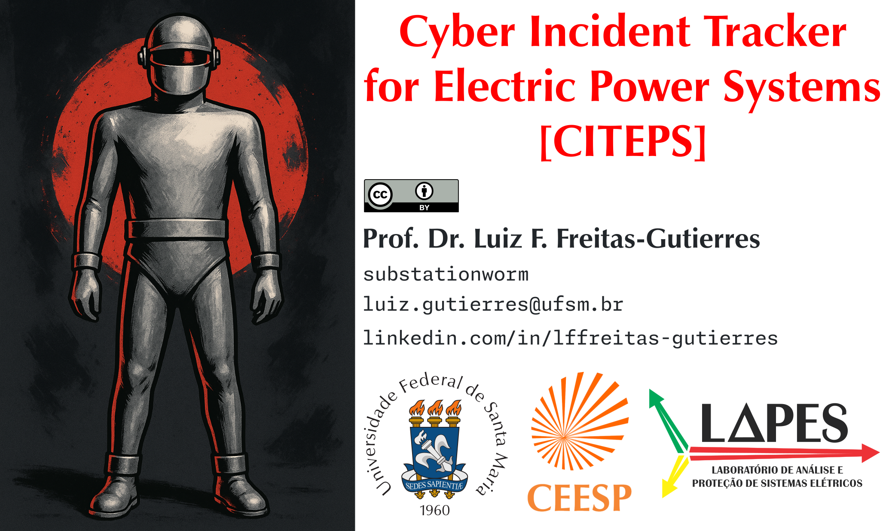

# CITEPS: Cyber Incident Tracker for Electric Power Systems

The **Cyber Incident Tracker for Electric Power Systems** (CITEPS) is an open-access repository designed to catalog cybersecurity incidents specifically affecting the electric power sector, with a focus on events involving operational technology (OT) assets and industrial control systems (ICS).

CITEPS is structured around cyber threat intelligence (CTI) and provides insights to support defensive strategies, risk assessment, and adversary simulation in the electric power sector.

CITEPS is an initiative linked to scientific research and technological innovation projects coordinated by [Prof. Dr. Luiz F. Freitas-Gutierres](https://www.linkedin.com/in/lffreitas-gutierres/) and carried out at the Federal University of Santa Maria ([UFSM](https://www.ufsm.br/)), in collaboration with external institutions.